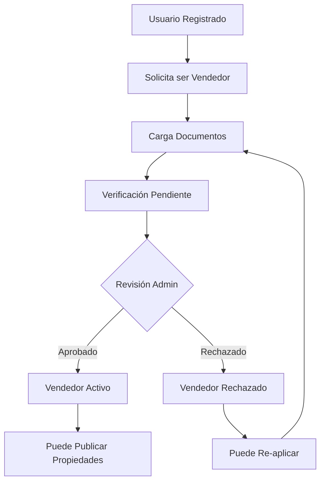
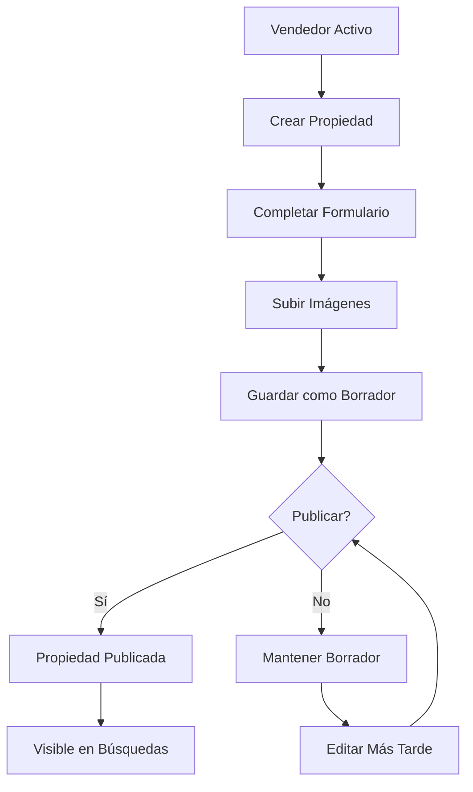

# Plan de Implementación: Flujo de Vendedores y Publicación de Propiedades

## Descripción General

Este documento detalla el plan completo para implementar el flujo que permitirá a usuarios registrarse como vendedores, cargar documentos de verificación, obtener aprobación y publicar propiedades en la plataforma HOMEVER.

## Índice

1. [Análisis del Estado Actual](#análisis-del-estado-actual)
2. [Arquitectura del Flujo de Vendedores](#arquitectura-del-flujo-de-vendedores)
3. [Proceso de Registro como Vendedor](#proceso-de-registro-como-vendedor)
4. [Sistema de Verificación y Documentos](#sistema-de-verificación-y-documentos)
5. [Dashboard del Vendedor](#dashboard-del-vendedor)
6. [Publicación de Propiedades](#publicación-de-propiedades)
7. [Sistema de Aprobaciones](#sistema-de-aprobaciones)
8. [Consideraciones de Seguridad](#consideraciones-de-seguridad)
9. [Implementación Técnica](#implementación-técnica)
10. [Cronograma de Desarrollo](#cronograma-de-desarrollo)

---

## Análisis del Estado Actual

### Base de Datos Existente

La base de datos ya contempla la estructura necesaria para vendedores:

```sql
-- Tabla de usuarios con roles diferenciados
users:
- id (uuid)
- email (varchar)
- name (varchar)
- phone (varchar)
- role (enum: 'user', 'seller', 'admin')
- seller_id (uuid, FK)

-- Tabla específica para vendedores
sellers:
- id (uuid)
- name (varchar)
- email (varchar)
- phone (varchar)
- license_number (varchar)
- company (varchar)
- documents (jsonb)
- verification_status (enum: 'pending', 'approved', 'rejected')
- created_at (timestamp)
- updated_at (timestamp)

-- Relación con propiedades
properties:
- seller_id (uuid, FK) -- Ya existe para asociar propiedades con vendedores
```

### Funcionalidades Existentes

✅ **Ya implementado:**
- Sistema de autenticación con Supabase Auth
- Roles básicos (user, seller, admin) en Redux
- Dashboard con diferentes vistas por rol
- CRUD de propiedades (limitado a admin actualmente)
- Sistema de búsqueda y filtros
- Integración con Mapbox

🔄 **Necesita adaptación:**
- Formulario de registro para vendedores
- Carga y gestión de documentos
- Aprobación de vendedores por admin
- Dashboard específico para vendedores
- Publicación de propiedades por vendedores

---

## Arquitectura del Flujo de Vendedores

### Estados del Vendedor



### Flujo de Propiedades



---

## Proceso de Registro como Vendedor

### Fase 1: Solicitud Inicial

**Página: `/seller/register`**

**Formulario de Solicitud:**
```typescript
interface SellerApplicationForm {
  personalInfo: {
    name: string;
    email: string;
    phone: string;
    address: string;
    city: string;
    state: string;
    zipCode: string;
  };
  professionalInfo: {
    licenseNumber: string;
    company?: string;
    yearsExperience: number;
    specialization: string[];
    website?: string;
    linkedIn?: string;
  };
  bankInfo: {
    bankName: string;
    accountNumber: string;
    routingNumber: string;
    accountType: 'checking' | 'savings';
  };
  documents: {
    professionalLicense: File;
    governmentId: File;
    proofOfAddress: File;
    businessLicense?: File;
    insuranceCertificate?: File;
  };
  termsAccepted: boolean;
  privacyPolicyAccepted: boolean;
}
```

**Validaciones del Frontend:**
- Email único en el sistema
- Número de licencia válido (formato por estado)
- Archivos en formatos permitidos (PDF, JPG, PNG)
- Tamaño máximo de archivos (5MB por documento)
- Campos obligatorios completos

### Fase 2: Validación Inicial

**Validaciones Automáticas:**
1. **Email**: Verificar que no exista como vendedor activo
2. **Licencia**: Validar formato según regulaciones locales
3. **Documentos**: Verificar integridad y formato de archivos
4. **Duplicados**: Verificar que no sea una aplicación duplicada

**Respuesta del Sistema:**
```typescript
interface ApplicationResponse {
  success: boolean;
  applicationId: string;
  status: 'submitted' | 'under_review' | 'additional_info_needed';
  estimatedReviewTime: string; // "3-5 business days"
  nextSteps: string[];
  errors?: ValidationError[];
}
```

---

## Sistema de Verificación y Documentos

### Tipos de Documentos Requeridos

**Documentos Obligatorios:**
1. **Licencia Profesional**: Licencia de agente inmobiliario válida
2. **Identificación Oficial**: Cédula, pasaporte o licencia de conducir
3. **Comprobante de Domicilio**: Recibo de servicios (máximo 3 meses)

**Documentos Opcionales:**
1. **Licencia de Negocio**: Para vendedores con empresa propia
2. **Certificado de Seguro**: Seguro de responsabilidad profesional
3. **Referencias Comerciales**: Cartas de recomendación

### Almacenamiento Seguro

**Configuración de Supabase Storage:**
```typescript
// Bucket para documentos de vendedores
const SELLER_DOCUMENTS_BUCKET = 'seller-documents';

// Políticas de seguridad
const documentPolicies = {
  // Solo el vendedor y admins pueden ver sus documentos
  SELECT: 'auth.uid() = user_id OR auth.jwt() ->> "role" = "admin"',
  // Solo el vendedor puede subir documentos a su carpeta
  INSERT: 'auth.uid() = user_id',
  // Solo admins pueden eliminar documentos
  DELETE: 'auth.jwt() ->> "role" = "admin"'
};

// Estructura de carpetas
// seller-documents/
//   ├── {seller_id}/
//   │   ├── license/
//   │   ├── identification/
//   │   ├── address_proof/
//   │   └── optional/
```

### Proceso de Verificación

**Componente: `DocumentVerification`**
```typescript
interface DocumentVerificationState {
  documents: {
    [key: string]: {
      status: 'pending' | 'approved' | 'rejected' | 'resubmit_required';
      fileName: string;
      uploadDate: Date;
      reviewDate?: Date;
      reviewNotes?: string;
      reviewer?: string;
    };
  };
  overallStatus: 'incomplete' | 'under_review' | 'approved' | 'rejected';
  rejectionReason?: string;
  nextSteps: string[];
}
```

---

## Dashboard del Vendedor

### Estructura de Navegación

**Layout del Dashboard:**
```typescript
// app/dashboard/seller/layout.jsx
const SellerDashboardLayout = () => {
  return (
    <div className="flex h-screen">
      <SellerSidebar />
      <main className="flex-1 overflow-auto">
        {children}
      </main>
    </div>
  );
};

// Navegación lateral
const sellerNavItems = [
  { href: '/dashboard/seller', label: 'Resumen', icon: Home },
  { href: '/dashboard/seller/properties', label: 'Mis Propiedades', icon: Building },
  { href: '/dashboard/seller/create', label: 'Publicar Propiedad', icon: Plus },
  { href: '/dashboard/seller/analytics', label: 'Estadísticas', icon: BarChart },
  { href: '/dashboard/seller/leads', label: 'Contactos', icon: Users },
  { href: '/dashboard/seller/profile', label: 'Mi Perfil', icon: User },
  { href: '/dashboard/seller/documents', label: 'Documentos', icon: FileText },
];
```

### Página Principal del Dashboard 

**Ruta: `/dashboard/seller`**

**Métricas y KPIs:**
```typescript
interface SellerDashboardData {
  summary: {
    totalProperties: number;
    activeListings: number;
    draftProperties: number;
    totalViews: number;
    totalInquiries: number;
    averageResponseTime: string;
  };
  recentActivity: Activity[];
  performanceMetrics: {
    viewsThisMonth: number;
    inquiriesThisMonth: number;
    conversionRate: number;
    averageDaysOnMarket: number;
  };
  quickActions: QuickAction[];
}
```

**Widgets del Dashboard:**
1. **Resumen de Propiedades**: Cards con métricas principales
2. **Actividad Reciente**: Lista de eventos recientes
3. **Propiedades Destacadas**: Grid de propiedades más vistas
4. **Gráficos de Rendimiento**: Visualizaciones de métricas
5. **Acciones Rápidas**: Botones para tareas comunes

### Gestión de Propiedades

**Ruta: `/dashboard/seller/properties`**

**Funcionalidades:**
- Lista de todas las propiedades del vendedor
- Filtros por estado (activa, borrador, pausada, vendida)
- Búsqueda por título, ubicación o ID
- Acciones rápidas (editar, pausar, duplicar, eliminar)
- Vista de estadísticas por propiedad

**Estados de Propiedades:**
```typescript
type PropertyStatus = 
  | 'draft'      // Borrador - no visible públicamente
  | 'active'     // Activa - visible en búsquedas
  | 'paused'     // Pausada - no visible pero no eliminada
  | 'sold'       // Vendida - archivada
  | 'expired';   // Expirada - necesita renovación
```

---

## Publicación de Propiedades

### Formulario de Creación

**Ruta: `/dashboard/seller/create`**

**Componente Principal:**
```typescript
// components/seller/PropertyCreationWizard.jsx
const PropertyCreationWizard = () => {
  const [step, setStep] = useState(1);
  const [formData, setFormData] = useState(initialPropertyData);
  
  const steps = [
    { id: 1, title: 'Información Básica', component: BasicInfoStep },
    { id: 2, title: 'Ubicación', component: LocationStep },
    { id: 3, title: 'Características', component: FeaturesStep },
    { id: 4, title: 'Imágenes', component: ImagesStep },
    { id: 5, title: 'Precio y Términos', component: PricingStep },
    { id: 6, title: 'Revisión', component: ReviewStep },
  ];
  
  return (
    <div className="property-creation-wizard">
      <StepProgress steps={steps} currentStep={step} />
      <StepContent step={step} data={formData} onChange={setFormData} />
      <StepNavigation 
        currentStep={step} 
        totalSteps={steps.length}
        onNext={() => setStep(step + 1)}
        onPrevious={() => setStep(step - 1)}
        onSave={saveDraft}
        onPublish={publishProperty}
      />
    </div>
  );
};
```

### Datos de la Propiedad

**Esquema Completo:**
```typescript
interface PropertyFormData {
  // Información básica
  title: string;
  description: string;
  propertyType: 'house' | 'apartment' | 'condo' | 'land' | 'commercial';
  listingType: 'sale' | 'rent';
  
  // Ubicación
  address: {
    street: string;
    city: string;
    state: string;
    zipCode: string;
    country: string;
    coordinates?: {
      lat: number;
      lng: number;
    };
  };
  
  // Características
  details: {
    bedrooms?: number;
    bathrooms?: number;
    totalArea: number;
    buildYear?: number;
    floors?: number;
    parking?: number;
    furnished?: boolean;
    petFriendly?: boolean;
  };
  
  // Amenidades
  amenities: string[];
  
  // Precios
  pricing: {
    price: number;
    currency: 'USD' | 'MXN';
    pricePerSqft?: number;
    maintenanceFee?: number;
    taxes?: number;
    deposit?: number; // Para rentas
  };
  
  // Imágenes
  images: {
    main: string; // URL de imagen principal
    gallery: string[]; // URLs de galería
    floorPlan?: string; // URL de plano
  };
  
  // Configuración
  settings: {
    showAddress: boolean;
    allowMessages: boolean;
    allowCalls: boolean;
    featuredListing: boolean;
    expirationDate?: Date;
  };
  
  // Metadatos
  metadata: {
    status: PropertyStatus;
    createdAt: Date;
    updatedAt: Date;
    sellerId: string;
    views: number;
    inquiries: number;
  };
}
```

### Validaciones y Reglas de Negocio

**Validaciones del Frontend:**
```typescript
const propertyValidationSchema = z.object({
  title: z.string().min(10).max(100),
  description: z.string().min(50).max(2000),
  price: z.number().positive().max(10000000),
  totalArea: z.number().positive(),
  images: z.object({
    main: z.string().url(),
    gallery: z.array(z.string().url()).min(3).max(20),
  }),
  address: z.object({
    street: z.string().min(5),
    city: z.string().min(2),
    state: z.string().min(2),
    zipCode: z.string().regex(/^\d{5}$/),
  }),
});
```

**Reglas de Negocio:**
1. **Límites por Vendedor**: Máximo 50 propiedades activas por vendedor
2. **Imágenes Requeridas**: Mínimo 3 fotos, máximo 20
3. **Precio Válido**: Entre $10,000 y $10,000,000 USD
4. **Ubicación Verificada**: Coordenadas válidas dentro del área de servicio
5. **Contenido Apropiado**: Validación de contenido ofensivo o spam

### Manejo de Imágenes

**Componente de Carga:**
```typescript
// components/seller/ImageUploader.jsx
const ImageUploader = ({ onImagesChange, maxImages = 20 }) => {
  const [images, setImages] = useState([]);
  const [mainImageIndex, setMainImageIndex] = useState(0);
  const [uploading, setUploading] = useState(false);
  
  const uploadImage = async (file) => {
    const fileName = `${Date.now()}-${file.name}`;
    const filePath = `properties/${sellerId}/${propertyId}/${fileName}`;
    
    const { data, error } = await supabase.storage
      .from('property-images')
      .upload(filePath, file, {
        cacheControl: '3600',
        upsert: false
      });
    
    if (error) throw error;
    
    const { data: { publicUrl } } = supabase.storage
      .from('property-images')
      .getPublicUrl(filePath);
    
    return publicUrl;
  };
  
  // Funciones para reordenar, eliminar, y marcar imagen principal
};
```

---

## Sistema de Aprobaciones

### Workflow de Aprobación

**Estados del Proceso:**
```typescript
type ApprovalStatus = 
  | 'pending_review'      // Esperando revisión inicial
  | 'under_review'        // En proceso de revisión
  | 'approved'            // Aprobado para vender
  | 'rejected'            // Rechazado con razones
  | 'suspended'           // Suspendido temporalmente
  | 'additional_info';    // Necesita información adicional
```

### Dashboard de Administración

**Ruta: `/dashboard/admin/sellers`**

**Funcionalidades para Admins:**
```typescript
interface AdminSellerManagement {
  pendingApplications: SellerApplication[];
  approvedSellers: SellerProfile[];
  rejectedApplications: SellerApplication[];
  suspendedSellers: SellerProfile[];
  
  actions: {
    reviewApplication: (id: string) => void;
    approveSeller: (id: string, notes?: string) => void;
    rejectSeller: (id: string, reason: string) => void;
    suspendSeller: (id: string, reason: string) => void;
    requestMoreInfo: (id: string, requirements: string[]) => void;
  };
}
```

**Componente de Revisión:**
```typescript
// components/admin/SellerReviewModal.jsx
const SellerReviewModal = ({ application, onClose, onAction }) => {
  const [decision, setDecision] = useState('');
  const [notes, setNotes] = useState('');
  
  return (
    <Modal size="lg">
      <ModalHeader>
        <h2>Revisar Solicitud de Vendedor</h2>
      </ModalHeader>
      
      <ModalBody>
        <SellerApplicationSummary application={application} />
        <DocumentsReview documents={application.documents} />
        <DecisionForm 
          decision={decision}
          notes={notes}
          onChange={(field, value) => {
            if (field === 'decision') setDecision(value);
            if (field === 'notes') setNotes(value);
          }}
        />
      </ModalBody>
      
      <ModalFooter>
        <Button variant="outline" onClick={onClose}>
          Cancelar
        </Button>
        <Button 
          variant="default" 
          onClick={() => onAction(decision, notes)}
          disabled={!decision}
        >
          Confirmar Decisión
        </Button>
      </ModalFooter>
    </Modal>
  );
};
```

### Notificaciones y Comunicación

**Sistema de Notificaciones:**
```typescript
interface NotificationSystem {
  // Email notifications
  sendApplicationReceived: (email: string, applicationId: string) => void;
  sendApplicationApproved: (email: string, sellerData: SellerProfile) => void;
  sendApplicationRejected: (email: string, reason: string) => void;
  sendAdditionalInfoRequired: (email: string, requirements: string[]) => void;
  
  // In-app notifications
  createNotification: (userId: string, notification: Notification) => void;
  
  // SMS notifications (optional)
  sendSMSUpdate: (phone: string, message: string) => void;
}
```

---

## Consideraciones de Seguridad

### Autenticación y Autorización

**Policies de Supabase (RLS):**
```sql
-- Solo vendedores pueden crear propiedades
CREATE POLICY "Sellers can create properties" ON properties
FOR INSERT WITH CHECK (
  auth.jwt() ->> 'role' = 'seller' 
  AND seller_id = auth.uid()
);

-- Solo vendedores pueden editar sus propiedades
CREATE POLICY "Sellers can update own properties" ON properties
FOR UPDATE USING (
  auth.jwt() ->> 'role' = 'seller' 
  AND seller_id = auth.uid()
);

-- Solo admins pueden ver documentos de vendedores
CREATE POLICY "Admins can view seller documents" ON seller_documents
FOR SELECT USING (auth.jwt() ->> 'role' = 'admin');

-- Vendedores pueden ver solo sus documentos
CREATE POLICY "Sellers can view own documents" ON seller_documents
FOR SELECT USING (seller_id = auth.uid());
```

### Validación de Datos

**Validaciones del Backend:**
```typescript
// utils/validation/sellerValidation.js
export const validateSellerApplication = (data) => {
  const errors = [];
  
  // Validar número de licencia
  if (!isValidLicenseNumber(data.licenseNumber, data.state)) {
    errors.push('Número de licencia inválido para el estado especificado');
  }
  
  // Validar documentos
  const requiredDocs = ['license', 'identification', 'addressProof'];
  for (const doc of requiredDocs) {
    if (!data.documents[doc]) {
      errors.push(`Documento requerido faltante: ${doc}`);
    }
  }
  
  // Validar información bancaria
  if (!isValidBankAccount(data.bankInfo)) {
    errors.push('Información bancaria inválida');
  }
  
  return { isValid: errors.length === 0, errors };
};
```

### Protección de Datos Sensibles

**Encriptación de Datos:**
```typescript
// utils/encryption.js
import CryptoJS from 'crypto-js';

export const encryptSensitiveData = (data) => {
  const secretKey = process.env.ENCRYPTION_SECRET;
  return CryptoJS.AES.encrypt(JSON.stringify(data), secretKey).toString();
};

export const decryptSensitiveData = (encryptedData) => {
  const secretKey = process.env.ENCRYPTION_SECRET;
  const bytes = CryptoJS.AES.decrypt(encryptedData, secretKey);
  return JSON.parse(bytes.toString(CryptoJS.enc.Utf8));
};

// Aplicar a datos bancarios y números de licencia
const encryptedBankInfo = encryptSensitiveData(bankInfo);
```

---

## Implementación Técnica

### Nuevos Componentes Requeridos

**1. Componentes de Autenticación:**
```
components/seller/
├── SellerRegistrationForm.jsx
├── DocumentUploader.jsx
├── ApplicationStatus.jsx
└── VerificationPending.jsx
```

**2. Dashboard del Vendedor:**
```
components/seller/dashboard/
├── SellerDashboard.jsx
├── PropertyManager.jsx
├── AnalyticsView.jsx
├── LeadManager.jsx
└── ProfileSettings.jsx
```

**3. Gestión de Propiedades:**
```
components/seller/properties/
├── PropertyCreationWizard.jsx
├── PropertyForm.jsx
├── ImageUploader.jsx
├── LocationPicker.jsx
└── PropertyPreview.jsx
```

**4. Administración:**
```
components/admin/sellers/
├── SellerApplicationList.jsx
├── SellerReviewModal.jsx
├── DocumentViewer.jsx
└── ApprovalWorkflow.jsx
```

### Nuevas Rutas y Páginas

**Rutas del Vendedor:**
```
app/seller/
├── register/
│   └── page.jsx          # Formulario de registro
├── application-status/
│   └── page.jsx          # Estado de la aplicación
└── onboarding/
    └── page.jsx          # Tutorial inicial

app/dashboard/seller/
├── page.jsx              # Dashboard principal
├── properties/
│   ├── page.jsx          # Lista de propiedades
│   ├── create/
│   │   └── page.jsx      # Crear propiedad
│   └── [id]/
│       ├── page.jsx      # Ver propiedad
│       └── edit/
│           └── page.jsx  # Editar propiedad
├── analytics/
│   └── page.jsx          # Estadísticas
├── leads/
│   └── page.jsx          # Gestión de contactos
├── profile/
│   └── page.jsx          # Perfil del vendedor
└── documents/
    └── page.jsx          # Gestión de documentos
```

**Rutas de Administración:**
```
app/dashboard/admin/sellers/
├── page.jsx              # Lista de vendedores
├── applications/
│   └── page.jsx          # Aplicaciones pendientes
├── [id]/
│   ├── page.jsx          # Perfil del vendedor
│   └── review/
│       └── page.jsx      # Revisar aplicación
└── analytics/
    └── page.jsx          # Analytics de vendedores
```

### Nuevos Slices de Redux

**authSlice.js (Extensión):**
```typescript
// lib/redux/slices/authSlice.js
const authSlice = createSlice({
  name: 'auth',
  initialState: {
    // ... estado existente
    sellerApplication: {
      status: null,
      applicationId: null,
      documents: {},
      verificationStatus: null,
    },
  },
  reducers: {
    // ... reducers existentes
    setSellerApplication: (state, action) => {
      state.sellerApplication = action.payload;
    },
    updateDocumentStatus: (state, action) => {
      const { documentType, status } = action.payload;
      state.sellerApplication.documents[documentType] = status;
    },
    setVerificationStatus: (state, action) => {
      state.sellerApplication.verificationStatus = action.payload;
    },
  },
});
```

**sellerSlice.js (Nuevo):**
```typescript
// lib/redux/slices/sellerSlice.js
const sellerSlice = createSlice({
  name: 'seller',
  initialState: {
    dashboard: {
      metrics: {},
      recentActivity: [],
      quickActions: [],
    },
    properties: {
      list: [],
      draft: null,
      filters: {},
      loading: false,
      error: null,
    },
    analytics: {
      performance: {},
      trends: {},
      comparisons: {},
    },
    leads: {
      contacts: [],
      conversations: [],
      filters: {},
    },
  },
  reducers: {
    setDashboardMetrics: (state, action) => {
      state.dashboard.metrics = action.payload;
    },
    addProperty: (state, action) => {
      state.properties.list.push(action.payload);
    },
    updateProperty: (state, action) => {
      const index = state.properties.list.findIndex(
        p => p.id === action.payload.id
      );
      if (index !== -1) {
        state.properties.list[index] = action.payload;
      }
    },
    setDraftProperty: (state, action) => {
      state.properties.draft = action.payload;
    },
    // ... más reducers
  },
});
```

### Nuevas Utilidades y Servicios

**Servicio de Vendedores:**
```typescript
// utils/supabase/sellers.js
export const sellerService = {
  // Crear aplicación de vendedor
  async createApplication(applicationData) {
    const { data, error } = await supabase
      .from('seller_applications')
      .insert(applicationData)
      .select()
      .single();
    
    if (error) throw error;
    return data;
  },
  
  // Subir documentos
  async uploadDocument(sellerId, documentType, file) {
    const fileName = `${documentType}_${Date.now()}.${file.name.split('.').pop()}`;
    const filePath = `${sellerId}/${documentType}/${fileName}`;
    
    const { data, error } = await supabase.storage
      .from('seller-documents')
      .upload(filePath, file);
    
    if (error) throw error;
    return data;
  },
  
  // Obtener estado de aplicación
  async getApplicationStatus(sellerId) {
    const { data, error } = await supabase
      .from('seller_applications')
      .select('*')
      .eq('seller_id', sellerId)
      .single();
    
    if (error) throw error;
    return data;
  },
  
  // Aprobar vendedor
  async approveSeller(applicationId, notes) {
    const { data, error } = await supabase
      .from('seller_applications')
      .update({
        status: 'approved',
        approved_at: new Date().toISOString(),
        admin_notes: notes,
      })
      .eq('id', applicationId)
      .select()
      .single();
    
    if (error) throw error;
    
    // Actualizar rol de usuario
    await supabase
      .from('users')
      .update({ role: 'seller' })
      .eq('id', data.seller_id);
    
    return data;
  },
};
```

**Validadores:**
```typescript
// utils/validation/sellerValidation.js
export const licenseValidation = {
  // Validar formato de licencia por estado
  validateLicenseNumber(licenseNumber, state) {
    const patterns = {
      'CA': /^[0-9]{8}$/,
      'TX': /^[0-9]{6}$/,
      'FL': /^[A-Z]{2}[0-9]{7}$/,
      // ... más estados
    };
    
    const pattern = patterns[state];
    return pattern ? pattern.test(licenseNumber) : true;
  },
  
  // Verificar si la licencia está activa (API externa)
  async verifyLicenseStatus(licenseNumber, state) {
    try {
      const response = await fetch(`/api/verify-license`, {
        method: 'POST',
        headers: { 'Content-Type': 'application/json' },
        body: JSON.stringify({ licenseNumber, state }),
      });
      
      const result = await response.json();
      return result.isValid;
    } catch (error) {
      console.error('License verification failed:', error);
      return false;
    }
  },
};
```

### APIs Necesarias

**Endpoint para Aplicaciones:**
```typescript
// app/api/seller/apply/route.js
export async function POST(request) {
  try {
    const applicationData = await request.json();
    
    // Validar datos
    const validation = validateSellerApplication(applicationData);
    if (!validation.isValid) {
      return NextResponse.json(
        { error: 'Datos inválidos', details: validation.errors },
        { status: 400 }
      );
    }
    
    // Crear aplicación
    const application = await sellerService.createApplication(applicationData);
    
    // Enviar notificación
    await notificationService.sendApplicationReceived(
      applicationData.email,
      application.id
    );
    
    return NextResponse.json({
      success: true,
      applicationId: application.id,
      status: 'submitted',
    });
    
  } catch (error) {
    console.error('Application submission error:', error);
    return NextResponse.json(
      { error: 'Error interno del servidor' },
      { status: 500 }
    );
  }
}
```

**Endpoint para Documentos:**
```typescript
// app/api/seller/documents/route.js
export async function POST(request) {
  try {
    const formData = await request.formData();
    const file = formData.get('file');
    const documentType = formData.get('type');
    const sellerId = formData.get('sellerId');
    
    // Validar archivo
    if (!file || file.size > 5 * 1024 * 1024) {
      return NextResponse.json(
        { error: 'Archivo inválido o muy grande' },
        { status: 400 }
      );
    }
    
    // Subir documento
    const result = await sellerService.uploadDocument(
      sellerId,
      documentType,
      file
    );
    
    return NextResponse.json({
      success: true,
      documentUrl: result.publicUrl,
    });
    
  } catch (error) {
    console.error('Document upload error:', error);
    return NextResponse.json(
      { error: 'Error al subir documento' },
      { status: 500 }
    );
  }
}
```

---

## Cronograma de Desarrollo

## Estado del Desarrollo - ACTUALIZADO

### ✅ Fase 1: Fundación (COMPLETADA)

**Semana 1-3: COMPLETADO**
- ✅ Configurar nuevas tablas en Supabase
- ✅ Crear políticas de seguridad (RLS)
- ✅ Configurar storage buckets para documentos
- ✅ Implementar validaciones básicas
- ✅ Crear slices de Redux (authSlice, sellerSlice)
- ✅ Implementar servicios base (sellers.js, validation, encryption)
- ✅ Crear endpoints API base (/api/seller/apply)

### 🔄 Fase 2: Funcionalidades Core (EN PROGRESO - 70% COMPLETADO)

**Semana 4-5: COMPLETADO**
- ✅ Desarrollar formulario de registro de vendedores (/seller/register)
- ✅ Implementar carga de documentos (DocumentUploader component)
- ✅ Crear páginas de estado de aplicación (/seller/application-status)
- ✅ Desarrollar dashboard básico del vendedor (/dashboard/seller)
- ✅ Implementar layout del dashboard con navegación
- ✅ Crear wizard de creación de propiedades (/dashboard/seller/properties/create)
- ✅ Desarrollar sistema de gestión de propiedades (/dashboard/seller/properties)
- ✅ Implementar APIs para propiedades (/api/seller/properties)

**Semana 6-7: EN PROGRESO**
- 🔄 Completar todos los pasos del wizard de propiedades
- ⏳ Implementar dashboard de administración  
- ⏳ Crear workflow de aprobaciones
- ⏳ Desarrollar sistema de revisión de documentos
- ⏳ Implementar notificaciones automáticas

### ⏳ Fase 3: Características Avanzadas (PENDIENTE)

**Semana 8-9: PENDIENTE**
- ⏳ Desarrollar analytics del vendedor
- ⏳ Implementar gestión de contactos
- ⏳ Crear sistema de mensajería
- ⏳ Desarrollar features de marketing

### ⏳ Fase 4: Deployment y Post-Launch (PENDIENTE)

**Semana 10-12: PENDIENTE**
- ⏳ Testing completo
- ⏳ Optimización de performance
- ⏳ Deployment a producción
- ⏳ Documentación final

---

## Componentes Implementados

### ✅ Páginas y Rutas Completadas:
- `/seller/register` - Formulario completo de registro con 6 pasos
- `/seller/application-status` - Seguimiento de estado de aplicación
- `/dashboard/seller` - Dashboard principal con métricas y actividad
- `/dashboard/seller/layout` - Layout base con navegación y notificaciones
- `/dashboard/seller/properties` - Lista de propiedades con filtros y acciones
- `/dashboard/seller/properties/create` - Wizard de creación de propiedades

### ✅ Componentes Reutilizables:
- `DocumentUploader` - Carga de documentos con validación
- `BasicInfoStep` - Primer paso del wizard de propiedades
- Componentes de UI base (Cards, Buttons, Forms, etc.)

### ✅ APIs Implementadas:
- `POST /api/seller/apply` - Envío de aplicación de vendedor
- `GET /api/seller/application-status` - Estado de aplicación
- `PUT /api/seller/application-status` - Actualización por admin
- `POST /api/seller/properties` - Crear propiedad
- `GET /api/seller/properties` - Listar propiedades del vendedor
- `POST /api/seller/documents` - Subir documentos

### ✅ Funcionalidades Clave:
- Registro completo de vendedores con validación
- Carga segura de documentos con encriptación
- Dashboard interactivo con métricas en tiempo real
- Gestión completa de propiedades (CRUD)
- Sistema de estados y workflow
- Validaciones frontend y backend
- Autenticación y autorización

---

## Consideraciones Adicionales

### Experiencia de Usuario

**Onboarding del Vendedor:**
1. **Welcome Tour**: Tutorial interactivo del dashboard
2. **Quick Setup**: Asistente para completar perfil
3. **First Property**: Guía paso a paso para primera publicación
4. **Best Practices**: Tips y recomendaciones personalizadas

**Soporte y Ayuda:**
1. **Centro de Ayuda**: Base de conocimientos integrada
2. **Chat en Vivo**: Soporte directo para vendedores
3. **Video Tutoriales**: Guías visuales para tareas comunes
4. **Webinars**: Entrenamientos en grupo

### Escalabilidad

**Optimizaciones de Base de Datos:**
```sql
-- Índices para consultas frecuentes
CREATE INDEX idx_properties_seller_status ON properties(seller_id, status);
CREATE INDEX idx_seller_applications_status ON seller_applications(status, created_at);
CREATE INDEX idx_property_views_seller_date ON property_views(seller_id, viewed_at);

-- Particionado por fecha para tablas grandes
CREATE TABLE property_views_2024 PARTITION OF property_views
FOR VALUES FROM ('2024-01-01') TO ('2025-01-01');
```

**Caching Strategy:**
```typescript
// Redis para datos frecuentemente accedidos
const cacheStrategy = {
  sellerDashboard: '15 minutes',
  propertyList: '5 minutes',
  analytics: '1 hour',
  notifications: 'real-time',
};
```

### Internacionalización

**Soporte Multi-idioma:**
```typescript
// i18n/es/seller.json
{
  "dashboard": {
    "title": "Panel de Vendedor",
    "welcome": "Bienvenido, {{name}}",
    "metrics": {
      "totalProperties": "Total de Propiedades",
      "activeListings": "Publicaciones Activas",
      "monthlyViews": "Vistas Este Mes"
    }
  },
  "forms": {
    "createProperty": "Crear Propiedad",
    "required": "Campo requerido",
    "invalidEmail": "Email inválido"
  }
}
```

### Cumplimiento Legal

**Regulaciones a Considerar:**
1. **GDPR/CCPA**: Protección de datos personales
2. **Regulaciones Inmobiliarias**: Cumplimiento por estado/país
3. **Anti-Money Laundering**: Verificación de identidad
4. **Accessibility**: Cumplimiento WCAG 2.1

**Auditoría y Logging:**
```typescript
const auditLogger = {
  logSellerAction: (sellerId, action, details) => {
    console.log({
      timestamp: new Date().toISOString(),
      sellerId,
      action,
      details,
      userAgent: request.headers['user-agent'],
      ip: request.ip,
    });
  },
  
  logAdminAction: (adminId, action, targetId, details) => {
    console.log({
      timestamp: new Date().toISOString(),
      adminId,
      action,
      targetId,
      details,
      level: 'admin',
    });
  },
};
```

---

## Conclusión

Este plan de implementación proporciona una hoja de ruta completa para desarrollar el flujo de registro y gestión de vendedores en la plataforma HOMEVER. La implementación se divide en fases manejables, cada una con objetivos claros y entregables específicos.

**Próximos Pasos:**
1. Revisar y aprobar este plan con el equipo
2. Configurar el entorno de desarrollo
3. Comenzar con la Fase 1: Fundación
4. Establecer métricas de éxito y KPIs
5. Definir criterios de aceptación para cada fase

**Beneficios Esperados:**
- Democratización de la publicación de propiedades
- Crecimiento del inventario de propiedades
- Nuevos flujos de ingresos por comisiones
- Mayor engagement de usuarios vendedores
- Plataforma más competitiva en el mercado

Este documento debe ser revisado y actualizado regularmente conforme avance el desarrollo, incorporando feedback del equipo y ajustes basados en la experiencia de implementación.
